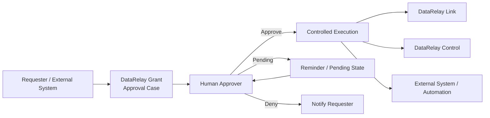

  

<h1 align="center">DataRelay Grant</h1>

  <strong>Human Approval Before Automation Executes.</strong>

  Put an explicit human decision between a requested action and its automated execution.

  <a href="https://github.com/datarelay-labs/datarelay-grant-docs">Documentation Source</a> ·
  <a href="https://patents.google.com/patent/US12056667B1/en">US Patent</a> ·
  <a href="https://patents.google.com/patent/KR102567118B1/ko">KR Patent</a>

  
  
  
  

---

## Approve first. Execute second.

DataRelay Grant is an upcoming approval-driven automation and execution-control product from DataRelay Labs.

It is being designed as a reusable **human-approval layer between a requested action and its execution**. A user or another system requests an action, the appropriate human makes an explicit decision, and the connected automation proceeds only when the decision permits it.

> **Request → Human Approval → Controlled Execution**

The initial product direction is based on the approval-management invention represented by **US 12,056,667 B1** and **KR 10-2567118 B1**.

## What it is designed to provide

| Capability | DataRelay Grant direction |
|---|---|
| **Approval cases** | Turn user or external-system requests into structured approval cases |
| **Human decision** | Capture explicit approve, pending, or deny outcomes |
| **Email approval** | Deliver lightweight approval interactions through email |
| **Pending workflow** | Keep pending as a real state and issue configured reminders |
| **Templates** | Reuse approval-case, approver, and workflow definitions |
| **Automation playbooks** | Associate approved requests with defined automated actions |
| **Composable operations** | Build workflows from reusable modules or unit operations |
| **External integration** | Exchange approval requests and results with other systems through APIs |
| **Execution gating** | Keep authorization separate from execution so protected actions do not run before approval |

These are **patent-backed product foundations and design directions**, not a claim that every capability is already implemented.

## Architecture direction

DataRelay Grant is intended to sit **between intent and execution**. It does not replace the product or system that ultimately performs the approved action.

## Patent foundation

| Jurisdiction | Patent | Title | Priority | Grant / publication |
|---|---|---|---|---|
| United States | [US 12,056,667 B1](https://patents.google.com/patent/US12056667B1/en) | System for managing approval request using email and the operating method thereof | 2023-03-13 | 2024-08-06 |
| Republic of Korea | [KR 10-2567118 B1](https://patents.google.com/patent/KR102567118B1/ko) | 전자메일을 사용하여 간편한 승인요청을 관리하는 시스템 및 그 동작방법 | 2023-03-13 | 2023-08-16 |

Inventor: **Young Oak Lee / 이영옥**

The two patents belong to the same underlying invention lineage and share the same priority foundation. Their issued claim sets are not word-for-word identical, so this repository treats them as the same **product technology foundation** rather than claiming identical legal scope.

## Product role

DataRelay Grant is planned as a common approval layer that can complement:

| System | Planned relationship |
|---|---|
| **DataRelay Link** | Add human authorization before selected connectivity or access actions |
| **DataRelay Control** | Add approval gates before selected governed data-operation changes or actions |
| **External systems** | Accept approval requests and return decisions through defined integration contracts |

DataRelay Link and DataRelay Control remain separate products with their own responsibilities. DataRelay Grant is intended to provide the reusable approval decision layer.

## Current status

Current project status: **Coming Soon / pre-release product definition**

This repository currently contains the product foundation and Engineering System metadata only.

Not yet published:

- production implementation
- public API contract
- authentication and authorization model
- deployment architecture
- operator UI
- release artifacts
- GA release scope

Planned behavior must not be treated as implemented behavior until code, contracts, tests, and release evidence exist.

## Product boundaries

DataRelay Grant is intentionally **not**:

- a replacement for DataRelay Link
- a replacement for DataRelay Control
- an IAM or identity-provider replacement
- a ticketing system
- a generic workflow engine
- a SIEM or SOAR platform
- an automatic authorization system that infers human approval from ambiguous text

Its product boundary is the **human approval and execution-control layer**.

## Engineering

This repository follows the canonical [Data Relay Labs Engineering System](https://github.com/datarelay-labs/engineering-system).

The current repository baseline identifies Engineering System **1.6.3** and keeps patent-described concepts, accepted product requirements, implemented behavior, and roadmap behavior explicitly separated.

## Documentation

| Topic | Link |
|---|---|
| Documentation source | [datarelay-grant-docs](https://github.com/datarelay-labs/datarelay-grant-docs) |
| US patent | [US 12,056,667 B1](https://patents.google.com/patent/US12056667B1/en) |
| Korean patent | [KR 10-2567118 B1](https://patents.google.com/patent/KR102567118B1/ko) |
| Engineering System | [datarelay-labs/engineering-system](https://github.com/datarelay-labs/engineering-system) |

Patent references are provided as product-background information. The official issued patent records and claims control the legal scope of the patents.

---

  <strong>Request. Approve. Execute.</strong>

  <a href="https://github.com/datarelay-labs/datarelay-grant-docs">Documentation</a> ·
  <a href="https://patents.google.com/patent/US12056667B1/en">US Patent</a> ·
  <a href="https://patents.google.com/patent/KR102567118B1/ko">KR Patent</a>

